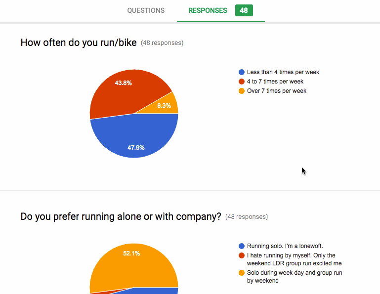
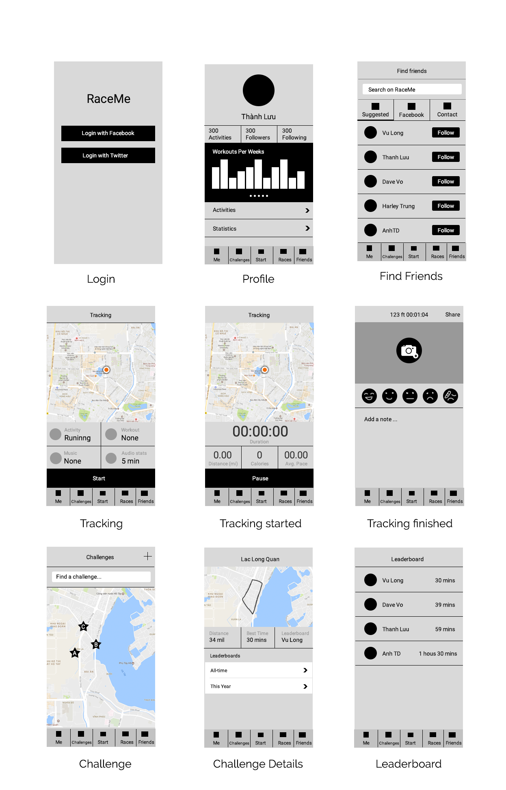

# WeRun - Connect Inspire Challenge

WeRun is a platform for sharing and exploring sport activities around one location in real time.

## User Stories

The following **Main** functionalities is completed:

A. ACCOUNT MANAGEMENT
- [x] User can sign in using Facebook
- [ ] User can sign in using Email, Twitter and Google
- [ ] User can sync their friend list from Contact, Facebook, Twitter, Google to find who has already registered at WeRun.
- [ ] User can send invitation to join WeRun to friends in contact list

B. ACTIVITY LOGGING
- [x] User can use the app to track their running/biking/hiking (Workout) activity
- [x] User can manually enter record of their Workout activity

C. CREATE AND EXPLORING GROUP CHALLENGES
- [ ] Route of Workout are automatically saved after an Workout activity is complete
- [ ] User can select an existing work out and enter next run date and time to share with other. User can chose to share this route with Friend only/Public => Now this is called a CHALLENGE
- [ ] When an upcoming CHALLENGE is shared. Users with the right permission can see it on EXPLORING screen.
    - [ ] User can explore CHALLENGES on maps to find near by routes.
    - [ ] User can see upcoming CHALLENGES of friend in their friendlist. This way, a User in a far city can decide to ~Virtually Join~ that workout with his friends 
- [ ] User can chose to join a CHALLENGES Shared by other user.
- [ ] All Users joined a CHALLENGE will be able to see list of participants

D. GROUP CHALLENGES in action
- [ ] Before CHALLENGE starttime. All participant recieve notification.
- [ ] When open app before start time, user will see list of participants that are READY for the CHALLENGE.
- [ ] User can click on button "I'm Ready" to enter Race Screen. Screen will display count down until start time
- [ ] On planned start time, all connected User device will Start the CHALLENGE in sync.
- [ ] During CHALLENGE time. All participant will receive live update of CHALLENGE statistic such as: who is leading, at what distance, who is infront - distance, who is behind - distance.
- [ ] When CHALLENGE completed. All participant can see result of the CHALLENGE
- [ ] Friends of participant that did not join CHALLENGE can also see result notification about their friend's CHALLENGE

E. SOLO WORK OUT - GHOST RUN
- [ ] User enter Start workout screen and can select the following option:
    - [ ] Workout type: Running/Biking/Hiking/Trail
    - [ ] Ghost select: chose a pass workout record to race agains.
    - [ ] Music: chose a playlist to play music from iTunes

F. PROFILE PAGE
- [x] User can set up their profile page with the following info
    - [x] Avatar. By default get from T/G/F
    - [x] Screen Name
    - [ ] Favourite Workout type
    - [ ] Favourtie Location
- [ ] User can set up their weekly working schedule with
    - [ ] Datetime
    - [ ] Location

The following **optional** features are implemented:

G. CREATE AND EXPLORING CHALLENGES
- [ ] User can import Record from other Systems to import workout history into WeRun.
- [ ] User can draw routes for next CHALLENGES on Map.
- [ ] After a CHALLENGE is created. User can chose wich friends from their friendlist to invite to this CHALLENGE.

H. SOLO WORK OUT - GHOST RUN
- [ ] User can chose a workout record of other user to race again.

## Survey Results

GIF created with [LiceCap](http://www.cockos.com/licecap/).

## Wireframe

## Notes

Describe any challenges encountered while building the app.

1. Working with location tracking. How to both increase the accuracy of geolocation points and not draining battery at the same time
2. Voice notification.
3. Live transaction and synchronization during Group Workout

## License

    Copyright 2017 The Dark Force Team

    Licensed under the Apache License, Version 2.0 (the "License");
    you may not use this file except in compliance with the License.
    You may obtain a copy of the License at

        http://www.apache.org/licenses/LICENSE-2.0

    Unless required by applicable law or agreed to in writing, software
    distributed under the License is distributed on an "AS IS" BASIS,
    WITHOUT WARRANTIES OR CONDITIONS OF ANY KIND, either express or implied.
    See the License for the specific language governing permissions and
    limitations under the License.

